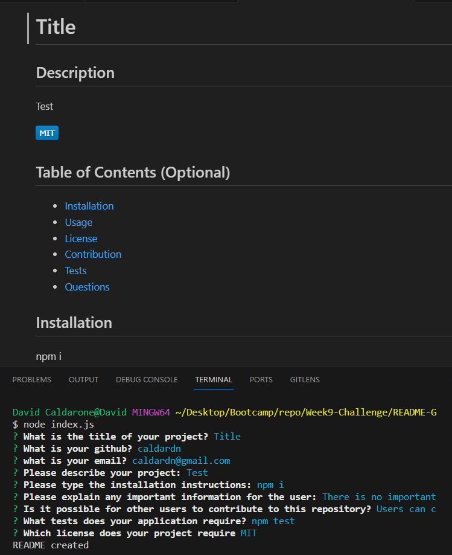

# README-Generator

## Description
In this application it provides the user a way to create a professional README file from the command line. The purpose of this application is to allow the developer to spend more time on their project and less time formatting a README file.

## Installation
This application will require you to have <a href="https://nodejs.org/en">Node.js</a> and <a href="https://www.npmjs.com/package/inquirer/v/8.2.4?activeTab=versions">Inquirer</a> 8.2.4. To install Inquirer go to your command line and submit inquirer@8.2.4

## Usage
To run this application type into your command line "node index" and the application will ask you question on what you would like to add to your README.

## Default Answer
The default answer is the writing in parentheses after the question, and it can be selected by the user by just clicking enter. If the user wishes to have a different selection they can write what they want to have instead.

## Video
<a href="https://drive.google.com/file/d/1FcFvgBx8gh3G4hTktZEGuh-POYba6zLH/view?usp=drive_link">Video Walkthrough</a>

## Contact Information
<a href="https://github.com/caldardn/README-Generator">Github Repo</a>

[Contact me](caldardn@gmail.com)

